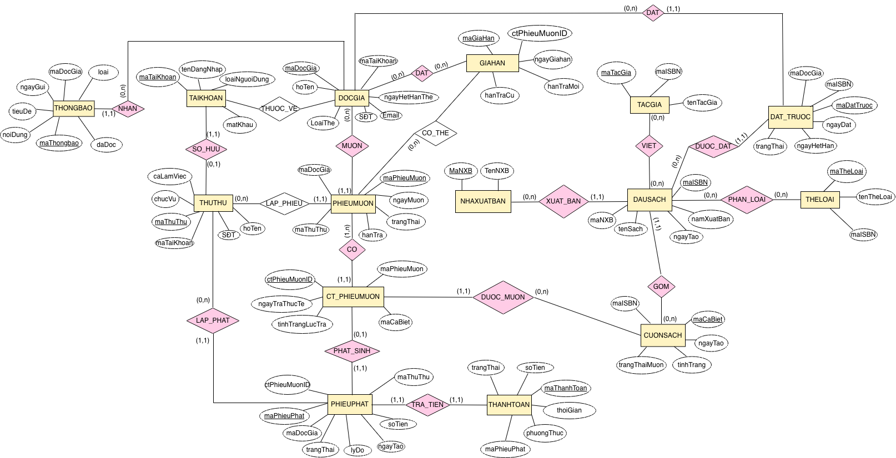
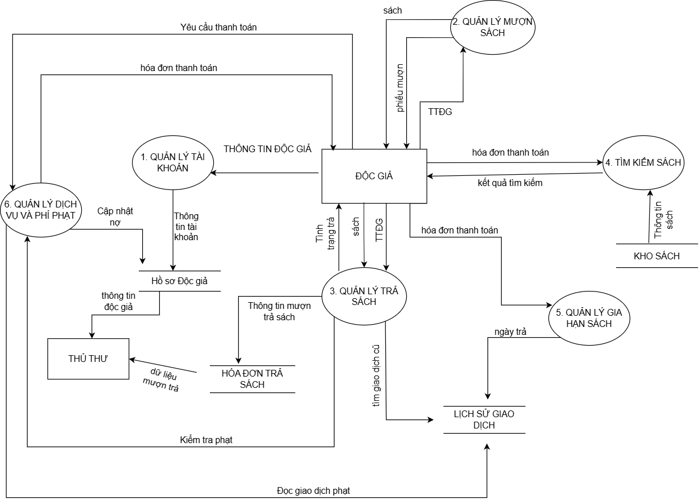

# 📚 Library Management System (LMS) - System Analysis & Data Modeling


## 📌 Project Overview
This repository contains the complete system analysis, architectural design, and data modeling for a modern **Library Management System (LMS)**. The project bridges the gap between business requirements and technical implementation, heavily focusing on **data integrity, process optimization, and scalable database design**. 


## 🎯 Business Problems Solved
Traditional libraries struggle with duplicate data, inefficient tracking of physical book copies, and manual fine calculations. This system architecture solves these by:
1. **Separating Metadata from Physical Assets:** Resolving the 1-to-N relationship between a Book Title (ISBN) and its Physical Copies (Barcodes) to track inventory accurately.
2. **Automated Circulation Logic:** Designing robust data flows for borrowing, returning, renewing, and queue-based reservation systems.
3. **Data-Driven Governance:** Centralizing member transactions and fine tracking to support future data analytics and reporting.

---

## 🏗️ 1. Data Architecture & ERD
A strictly normalized Entity-Relationship Diagram (Chen Notation) was designed to handle complex library operations.

*<p align="center">Insert your ERD image here</p>*


**Key Data Modeling Highlights:**
* **`DAUSACH` (Title) vs `CUONSACH` (Physical Item):** Modeled separately. Users search and reserve `DAUSACH`, but borrow a specific `CUONSACH`.
* **Reservation Queue (`PHIEUDATCHO`):** A dedicated entity to handle book holds, linking patrons directly to titles.
* **Transaction Granularity (`CT_PHIEUMUON`):** A bridge table capturing item-level return dates and conditions, enabling precise fine generation (`PHIEUPHAT`) for individual damaged or overdue items.
* **SQL Implementation:** The conceptual ERD has been translated into a fully structured DDL script. Check out the [schema.sql](sql/schema.sql) file.

---

## 🔄 2. System Workflows (Data Flow Diagrams)
To ensure smooth data handling across the system, Data Flow Diagrams (DFDs) were constructed for 9 core business processes.

### Highlight: Circulation Process (Borrow/Return)
*<p align="center">Insert your DFD Level 1 or 2 image here</p>*


The structured analysis ensures that every input (e.g., scanning a patron's card) is validated against necessary data stores (Patron Database, Fines Database) before altering the state of the book inventory.

---

## 🛠️ Repository Structure
```text
📦 LMS-System-Design
 ┣ 📂 docs/
 ┃ ┣ 📜 Final_Report_LMS.pdf       # Full technical report (Vietnamese)
 ┃ ┗ 📂 images/                    # High-res diagrams (ERD, DFD, Use Case)
 ┣ 📂 sql/
 ┃ ┗ 📜 schema.sql                 # Complete DDL script for database creation
 ┗ 📜 README.md
